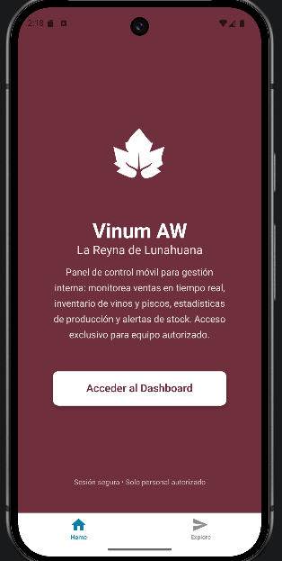

# Vinum AW 🍷

Aplicación móvil interna para la gestión de ventas, inventario y estadísticas de la bodega La Reyna de Lunahuana.

## Parte 2: Pantalla Inicial (Home / Dashboard)

Esta es la pantalla de bienvenida y acceso principal al panel de control.

- **Título**: Vinum AW Enterprise
- **Descripción**: Panel de control móvil para monitorear ventas, inventario y estadísticas en tiempo real.
- **Botón principal**: Acceder al Dashboard
- **Colores**: Guinda institucional (#702F3D) y blanco para alto contraste y profesionalismo.
